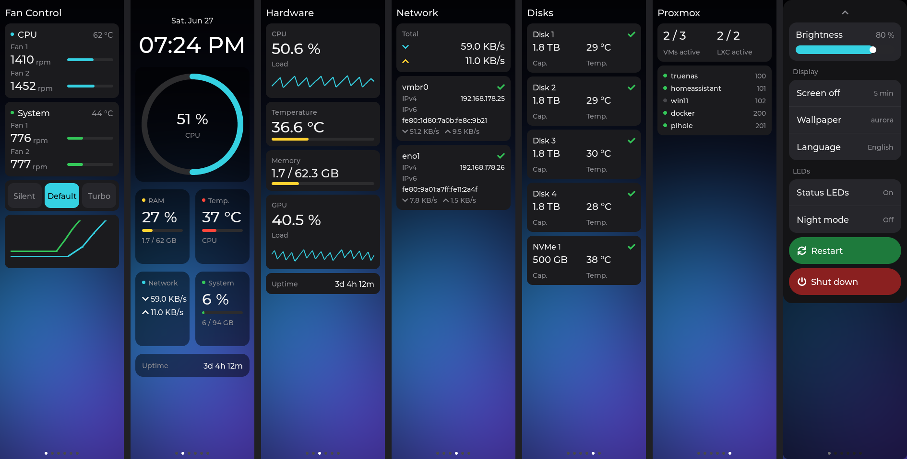

# ugreen-idx6011-panel

Touch dashboard and front-LED control for the UGREEN NASync iDX6011 Pro on Proxmox, Debian, TrueNAS SCALE and Unraid.
*Community project — not affiliated with or endorsed by UGREEN.*

[](../../releases/latest)


[](LICENSE)

The iDX6011 Pro has a 258×960 touch display on the front. Under UGOS it shows
system stats; under Proxmox, Debian, TrueNAS or Unraid it stays black — and
the 9 front status LEDs cycle a rolling demo animation forever.

**ug-paneld** fixes both: a UGOS-style touch dashboard driven entirely from
userspace (no proprietary backend, no display kernel patches), plus a
complete [front-LED setup](#front-panel-leds).



## Highlights

- 🖥️ **Six swipeable pages** — Home (clock, CPU ring, glass tiles), Hardware,
  Network, Disks, Proxmox guests (PVE hosts only), OPNsense (optional)
- 👆 **Touch works** — swipe between pages, pull-down settings panel with
  brightness, screen-off timeout, wallpaper, language (DE/EN),
  restart/shutdown
- 💡 **Front LED control** — stops the rolling animation; disk activity +
  SMART health + network blinking; LED toggle and **night mode**
  (21:00–08:00, configurable) right on the display
- 🌙 **Screen sleep** — black frame + backlight off after idle, tap to wake
- 🎨 **Wallpapers** behind every page (3 built-ins + your own PNG)
- 🏠 **Home Assistant** — optional HTTP API exposes the backlight as a light
  entity
- 📦 Packaged for **Proxmox/Debian** (.deb), **TrueNAS SCALE** and
  **Unraid** (tarballs)

## Install

Grab the latest packages from the [releases page](../../releases).

**Proxmox / Debian** (and other systemd distros):

```bash
dpkg -i ug-paneld_*_amd64.deb        # installs, enables + starts the service
```

> A `no-blacklist` variant exists if you prefer to handle the `i2c-hid-acpi`
> module yourself.

**TrueNAS SCALE** (Linux-based; CORE is not supported) — installs to a pool,
starts via an auto-registered Post-Init script:

```bash
tar xzf ug-paneld_*_truenas_amd64.tar.gz && cd ug-paneld
sh install.sh /mnt/<your-pool>/ug-paneld
```

**Unraid** — persists on the flash drive, hooks into `/boot/config/go`:

```bash
tar xzf ug-paneld_*_unraid_amd64.tar.gz && cd ug-paneld
sh install.sh
```

> [!NOTE]
> Everything here is **field-tested on Proxmox VE on real hardware** (a
> newer-revision iDX6011 Pro). The TrueNAS SCALE and Unraid packages —
> display and LEDs alike — ship the identical binaries and mirror that
> proven setup, but have not been run on those platforms yet. If you try
> them, feedback (good or bad) via the issues is very welcome.

> [!IMPORTANT]
> **Display stays black?** On newer iDX6011 Pro revisions the panel power is
> switched by the embedded controller and vanilla Linux doesn't know how.
> The one-time fix: boot UGOS once, then **reboot** (don't power off) into
> your Linux drive via the firmware boot menu (F11/F12). The EC keeps the
> panel powered persistently — verified to survive reboots, shutdowns and
> mains cuts. Details in [Troubleshooting](#troubleshooting).

## Front panel LEDs

The 9 RGB status LEDs (power, 2× LAN, 6× disk) are driven by a separate MCU
with a protocol that differs from older UGREEN models — reverse-engineered in
[miskcoo/ugreen_leds_controller#93](https://github.com/miskcoo/ugreen_leds_controller/issues/93)
and implemented in
[klein0r's fork](https://github.com/klein0r/ugreen_leds_controller) (all
credit to them).

**Proxmox / Debian** — full setup (kernel module via DKMS, live activity +
SMART health colors). Run as root on the **host**:

```bash
wget https://raw.githubusercontent.com/Reevoy24/ugreen-idx6011-panel/master/tools/setup-ugreen-leds.sh
bash setup-ugreen-leds.sh
```

The rolling animation stops immediately; disk LEDs show activity and health,
LAN LEDs blink on traffic, everything survives reboots and kernel updates.
With the setup installed, the ug-paneld settings panel gains a **Status LEDs
on/off row and a night mode row** (LEDs off automatically between
`led_night_start` and `led_night_end`, default 21:00–08:00 — turning them on
during the window overrides it until the window ends).

**TrueNAS SCALE / Unraid** — ready-made tarballs (`ugreen-leds_*`) from the
[releases page](../../releases): same one-command install pattern as above.
They stop the animation at boot, set a calm base state and run a small
userspace activity monitor (busy = hardware blink, idle = solid; no kernel
module, survives every platform update). Proper per-I/O triggers need the
kernel module built for those kernels — tracked upstream in
[ich777/unraid-ugreenleds-driver#8](https://github.com/ich777/unraid-ugreenleds-driver/issues/8)
and
[0x556c79/install_ugreen_leds_controller#23](https://github.com/0x556c79/install_ugreen_leds_controller/issues/23)
(a 👍 there helps).

<details>
<summary><b>LED notes: bay order, LAN order, manual control</b></summary>

- **Bay order:** the default ata-based disk→LED mapping is not yet verified
  on the iDX6011 Pro. Generate I/O on one disk and check that the right bay
  blinks; if the order is wrong, run `ugreen-detect-disks` and switch
  `/etc/ugreen-leds.conf` to `MAPPING_METHOD=serial`.
- **LAN port order:** if LAN1/LAN2 are swapped, set
  `NETLED_IFACES="<nic1> <nic2>"` in `/etc/default/ugreen-idx-netled`
  (Proxmox) or `NICS="..."` in `ugreen-leds-mon.conf` (TrueNAS/Unraid).
- **Manual control:** the CLI tool and the kernel module conflict — stop the
  LED services and `rmmod led_ugreen` before using `ugreen_leds_cli` by hand.
- **LED toggle semantics:** "off" on the display stops `ugreen-diskiomon`
  and zeroes every LED; "on" restarts the monitors. Persists in
  `state.json`.

</details>

## Configuration

Everything is optional — without a config file ug-paneld auto-detects the
display, touch and sensible defaults. Create `/etc/ug-paneld/config.json` to
override:

```json
{
    "poll_rate": 2,
    "brightness": 100,
    "backlight_timeout": 30,
    "sleep_brightness": 0,
    "led_night_start": "21:00",
    "led_night_end": "08:00",
    "api_port": 0,
    "opnsense_url": "https://192.168.1.1:8443",
    "opnsense_key": "your-api-key",
    "opnsense_secret": "your-api-secret",
    "wan_interface": "wan",
    "wan_max_mbps": 1000
}
```

Settings changed on the display itself (brightness, timeout, wallpaper,
language, LED switches) persist separately in `/etc/ug-paneld/state.json` —
your `config.json` is never rewritten.

<details>
<summary><b>All config keys</b></summary>

| Key | Default | Description |
|-----|---------|-------------|
| `poll_rate` | `2` | How often to poll system stats (seconds) |
| `brightness` | `100` | Backlight brightness (1-100) |
| `backlight_timeout` | `30` | Seconds before the screen sleeps (0 = never) |
| `sleep_brightness` | `0` | Backlight % while asleep; `0` = fully off (tap-to-wake keeps working) |
| `led_night_start` | `21:00` | Front-LED night window start (`HH:MM`) |
| `led_night_end` | `08:00` | Front-LED night window end (`HH:MM`) |
| `api_port` | `0` | HTTP API port for backlight control (0 = disabled) |
| `boot_settle_secs` | `120` | Cold-boot settle: re-assert the backlight and hold off the idle timeout until the EC accepts it (panel lit), capped at this many seconds of uptime; 0 = off |
| `drm_device` | auto | DRM device path, e.g. `/dev/dri/card0`; empty = scan all (legacy key `drm_card` works) |
| `connector` | `auto` | DRM connector: name (`eDP-1`), numeric id, or `auto` |
| `drm_probe_timeout` | `60` | Seconds to wait at startup for a connected connector (high so the early-boot start waits for the panel instead of giving up) |
| `i2c_device` | `auto` | ACPI id to unbind from `i2c_hid_acpi`: `auto` (knows `CUST0000:00` + `MSFT8000:00`), `none`, or a specific id |
| `touch_device` | `auto` | Touch I2C bus: `auto` resolves it from the ACPI link; explicit `/dev/i2c-2` works |
| `debug` | `false` | Verbose DRM probe logging |
| `opnsense_url` / `_key` / `_secret` | | OPNsense API (empty = page disabled) |
| `wan_interface` | `wan` | OPNsense interface for the WAN gauges |
| `wan_max_mbps` | `1000` | Scales the WAN arc gauges |

</details>

<details>
<summary><b>HTTP API + Home Assistant light entity</b></summary>

Set `api_port` (e.g. `9101`) to control the backlight remotely. Brightness
set through the API survives sleep/wake cycles.

```bash
curl http://<nas>:9101/backlight                          # {"state":"on","brightness":100}
curl -X POST http://<nas>:9101/backlight -d '{"state":"off"}'
curl -X POST http://<nas>:9101/backlight -d '{"brightness":50}'
```

Home Assistant `configuration.yaml` for a light entity with brightness
slider:

```yaml
rest_command:
  nas_display_backlight:
    url: "http://<nas>:9101/backlight"
    method: POST
    content_type: "application/json"
    payload: "{{ payload }}"

rest:
  - resource: "http://<nas>:9101/backlight"
    scan_interval: 10
    sensor:
      - name: "NAS Display State"
        value_template: "{{ value_json.state }}"
      - name: "NAS Display Brightness"
        value_template: "{{ value_json.brightness }}"

template:
  - light:
      - name: "NAS Display"
        unique_id: nas_display_backlight
        optimistic: true
        state: "{{ 'on' if states('sensor.nas_display_state') == 'on' else 'off' }}"
        level: "{{ (states('sensor.nas_display_brightness') | int * 2.55) | round }}"
        turn_on:
          service: rest_command.nas_display_backlight
          data: { payload: '{"state":"on"}' }
        turn_off:
          service: rest_command.nas_display_backlight
          data: { payload: '{"state":"off"}' }
        set_level:
          service: rest_command.nas_display_backlight
          data: { payload: '{"brightness":{{ (brightness / 2.55) | round }}}' }
```

</details>

<details>
<summary><b>OPNsense page endpoints</b></summary>

| Endpoint | Shown as |
|----------|----------|
| `/api/routes/gateway/status` | Gateway RTT + status |
| `/api/core/firmware/status` | Update availability |
| `/api/dhcpv4/leases/searchLease` | Active DHCP lease count |
| `/api/unbound/overview/totals/0` | DNS queries / blocked % |
| `/api/interfaces/traffic/top/{interface}` | WAN in/out gauges |

Create the API key in OPNsense under System → Access → Users.

</details>

## How it works

Everything runs in userspace — no display kernel patches:

| Component | Chip | Interface | Driven via |
|-----------|------|-----------|------------|
| Display | eDP panel, 258×960 ARGB | DRM | standard Linux DRM, device/connector auto-detected |
| Backlight | ITE IT55xx embedded controller | x86 port I/O (`0x62`/`0x66`) | `iopl(3)` + `outb`/`inb` |
| Touch | AXS15231B-compatible (`CUST0000:00` / `MSFT8000:00`) | I2C @ `0x3b` | bus resolved from the ACPI device link |
| Front LEDs | Holtek HT32F52231 MCU | I2C @ `0x3a` (SMBus) | [LED setup](#front-panel-leds) |

<details>
<summary><b>Backlight EC protocol (+ test snippet)</b></summary>

1. Wait for the Input Buffer Full (IBF) flag to clear on port `0x66`
2. Write `0x81` to `0x66` (EC write-memory command)
3. Wait for IBF clear, write `0xA5` to `0x62` (backlight address)
4. Wait for IBF clear, write the brightness value to `0x62`

Brightness is inverted: `1` = full, `198` = off. Test from the shell:

```bash
python3 -c "
f=open('/dev/port','r+b',buffering=0)
import time
def wb(p,v): f.seek(p); f.write(bytes([v]))
def rb(p): f.seek(p); return f.read(1)[0]
def wait():
    for _ in range(5000):
        if not (rb(0x66) & 0x02): return
        time.sleep(0.0001)
wait(); wb(0x66,0x81); wait(); wb(0x62,0xA5); wait(); wb(0x62,198)  # off
"
```

The same EC handles fan/watchdog/power in UGOS' proprietary
`ug_idx6011pro-sio.ko`; ug-paneld only touches the backlight register.

</details>

<details>
<summary><b>Touch protocol (AXS15231B)</b></summary>

Same controller family as some ESP32 boards — the protocol matches
[ESPHome's AXS15231B driver](https://api-docs.esphome.io/axs15231__touchscreen_8cpp_source).

Read command (8 bytes): `0xB5 0xAB 0xA5 0x5A 0x00 0x00 0x00 0x08`

```c
uint8_t  event = byte[2] >> 6;                  /* 0=down, 1=up, 2=contact */
uint16_t x = (byte[2] & 0x0F) << 8 | byte[3];   /* 12-bit, 0-257 */
uint16_t y = (byte[4] & 0x0F) << 8 | byte[5];   /* 12-bit, 0-959 */
uint8_t  id = byte[4] >> 4;                     /* touch point id */
```

Probe from the shell (with `i2c-hid-acpi` unbound):

```bash
i2ctransfer -y 2 w8@0x3b 0xB5 0xAB 0xA5 0x5A 0x00 0x00 0x00 0x0E r14
```

</details>

## Troubleshooting

> [!WARNING]
> **Never diagnose the touch controller with ug-paneld stopped.** The chip
> auto-sleeps when nobody polls it and then answers every I2C transaction
> with constant `0x23` bytes — indistinguishable from a broken chip. The
> running daemon's 33–50 ms polling keeps it awake (that's also why
> tap-to-wake works with the backlight fully off).

**Display black, service exits with code 2** ("No connected DRM connector
found"): the kernel never brought up the panel. On newer revisions the panel
power rail is switched by the EC — apply the UGOS warm-boot fix from the
[Install](#install) section. Useful checks:

```bash
for x in /sys/class/drm/card*-*/status; do echo "$x: $(cat $x)"; done   # one "connected"?
ls /sys/bus/i2c/devices/            # CUST0000 or MSFT8000 revision?
journalctl -u ug-paneld -n 100      # full DRM probe inventory is logged
```

<details>
<summary><b>Background: why newer revisions boot with a dead panel</b></summary>

The BIOS declares the panel correctly (healthy VBT: eDP on DDI-A/AUX-A,
1 lane, 258×960), but the panel's power rail is controlled by the ITE EC,
not the Intel PCH. Unpowered, the panel never answers on the AUX channel, so
i915 logs `failed to retrieve link info, disabling eDP` and gives up. UGOS
powers the rail through its proprietary EC driver; vanilla Linux doesn't
know it has to. The EC stores the power flag persistently — hence the
one-time UGOS warm-boot fix (verified across reboots, shutdowns and a
multi-minute mains cut; repeat only after an EC reset or firmware update).

Newer revisions also enumerate the touchscreen as `MSFT8000:00` instead of
`CUST0000:00`; ug-paneld knows both ids. The DRM card number can change
between boots (`card0`/`card1`) — ug-paneld scans all of them.

If a connector **is** connected but the screen stays black, set
`"debug": true`, restart, and read the journal: every device, connector and
mode decision is logged.

</details>

## Build from source

```bash
apt install build-essential libdrm-dev libcurl4-openssl-dev pkg-config
git clone --recursive https://github.com/Reevoy24/ugreen-idx6011-panel
cd ugreen-idx6011-panel
make                 # binary: ./ug-paneld   (requires root to run)
./build-deb.sh 1.4.0           # .deb packages
./build-tarballs.sh 1.4.0      # TrueNAS/Unraid tarballs
./build-mockups.sh             # render all pages as PNGs (no hardware needed)
```

Running a self-built binary manually: the `i2c-hid-acpi` module grabs the
touchscreen on boot — ug-paneld unbinds it automatically and logs what it
did (the .deb blacklists it instead). For boot-start, install
`ug-paneld.service` into `/etc/systemd/system/`.

## Credits

- [Adam Conway's original ug-paneld](https://github.com/Incipiens/ugreen-idx6011-pro-nas-display) —
  the project this repo was forked from
- [klein0r/ugreen_leds_controller](https://github.com/klein0r/ugreen_leds_controller) —
  iDX6011 Pro LED protocol + driver fork, building on
  [miskcoo/ugreen_leds_controller](https://github.com/miskcoo/ugreen_leds_controller)
  and the findings in [issue #93](https://github.com/miskcoo/ugreen_leds_controller/issues/93)
- [ESPHome AXS15231B driver](https://api-docs.esphome.io/axs15231__touchscreen_8cpp_source) —
  touchscreen protocol reference
- [LVGL](https://lvgl.io) — the UI toolkit rendering the dashboard (MIT)
- Fonts: [Montserrat](https://fonts.google.com/specimen/Montserrat)
  (SIL OFL 1.1) and [Font Awesome Free](https://fontawesome.com/license/free)
  symbols — embedded as bitmap fonts exactly like LVGL's built-ins
